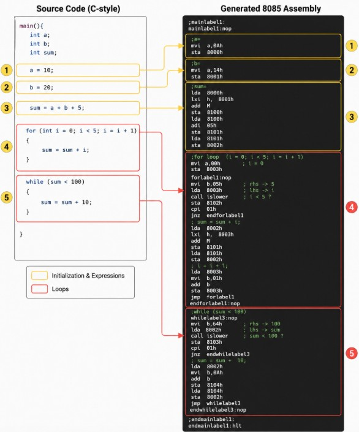
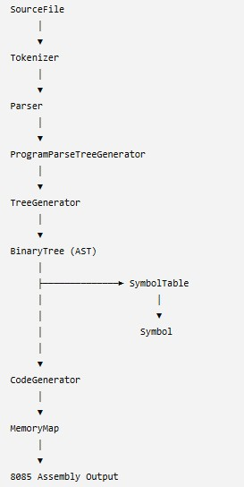
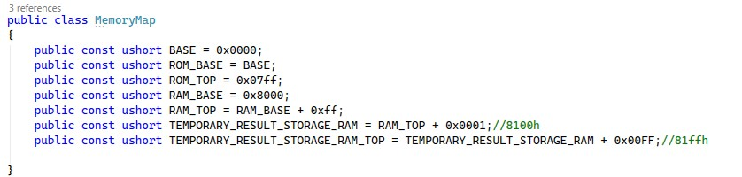

# myCJCompiler C/Java to 8085 Assembly Language
Experimental C/Java-to-8085 compiler with parsing, trees, and regex-based analysis.

This repository explores how to convert high-level language constructs in **C** and **Java** into equivalent **8085 Assembly Language** instructions.

---

## 🔍 Focus Areas

This project covers a broad range of topics in computer science and systems programming:

- ✅ **Data Structures**
- ✅ **Parsing Techniques**
- ✅ **Syntax Trees / Abstract Syntax Trees (AST)**
- ✅ **Code Translation**
- ✅ **Assembly Language Programming (8085)**
- ✅ **C Language Semantics**
- ✅ **Java Language Constructs**
- ✅ **C# for tooling and support examples**
- ✅ **Regular Expressions** (used for lexical analysis and pattern recognition)
- ✅ **Intermediate Representation and Symbol Tables**

---

## 🧠 Why This Project?

Understanding how high-level programming constructs are translated into low-level instructions bridges the gap between software and hardware. This project is ideal for:

- Students learning compilers and systems programming
- Developers interested in low-level code generation
- Educators looking for simple demonstrators
- Anyone curious about what happens "under the hood"

> **Future Work:** Build a backend assembler that maps assembly mnemonics to their binary opcodes, producing executable machine code for the target processor.
---

example program:

Compiler Pipeline:

Memory Map 8085 emulator:

Lexical analysis:

0 : (main, keyword)
1 : ((, symbol)
2 : (), symbol)
3 : ({, symbol)
4 : (int, keyword)
5 : (a, Identifier)
6 : (;, symbol)
7 : (int, keyword)
8 : (b, Identifier)
9 : (;, symbol)
10 : (int, keyword)
11 : (sum, Identifier)
12 : (;, symbol)
13 : (a, Identifier)
14 : (=, symbol)
15 : (10, Numeric Constant)
16 : (;, symbol)
17 : (b, Identifier)
18 : (=, symbol)
19 : (20, Numeric Constant)
20 : (;, symbol)
21 : (sum, Identifier)
22 : (=, symbol)
23 : (a, Identifier)
24 : (+, symbol)
25 : (b, Identifier)
26 : (+, symbol)
27 : (5, Numeric Constant)
28 : (;, symbol)
29 : (for, keyword)
30 : ((, symbol)
31 : (int, keyword)
32 : (i, Identifier)
33 : (=, symbol)
34 : (0, Numeric Constant)
35 : (;, symbol)
36 : (i, Identifier)
37 : (<, symbol)
38 : (5, Numeric Constant)
39 : (;, symbol)
40 : (i, Identifier)
41 : (=, symbol)
42 : (i, Identifier)
43 : (+, symbol)
44 : (1, Numeric Constant)
45 : (), symbol)
46 : ({, symbol)
47 : (sum, Identifier)
48 : (=, symbol)
49 : (sum, Identifier)
50 : (+, symbol)
51 : (i, Identifier)
52 : (;, symbol)
53 : (}, symbol)
54 : (while, keyword)
55 : ((, symbol)
56 : (sum, Identifier)
57 : (<, symbol)
58 : (100, Numeric Constant)
59 : (), symbol)
60 : ({, symbol)
61 : (sum, Identifier)
62 : (=, symbol)
63 : (sum, Identifier)
64 : (+, symbol)
65 : (10, Numeric Constant)
66 : (;, symbol)
67 : (}, symbol)
68 : (}, symbol)
 accepted : main(){
 accepted : inta;
 accepted : intb;
 accepted : intsum;
 accepted : a=10;
 accepted : b=20;
 accepted : sum=a+b+5;
 accepted : for(inti=0;i<5;i=i+1){
 accepted : sum=sum+i;
}
 accepted : while(sum<100){
 accepted : sum=sum+10;
}
}
Parsing complete!!
variable:a(int) scope:1
variable:b(int) scope:1
variable:sum(int) scope:1
variable:i(int) scope:2
{
a=10;b=20;sum=a+b+5;i=0;Condition=i<5;i=i+1;{
sum=sum+i;}
Condition=sum<100;{
sum=sum+10;}
}